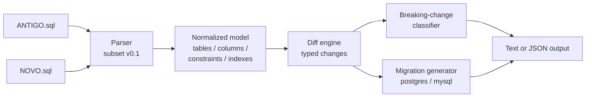

# schema-diff

A command-line tool that compares two SQL schema files and produces a typed list of changes, a migration in the chosen dialect and a breaking-change classification.


> The animated demo is generated with [`vhs`](https://github.com/charmbracelet/vhs) from the versioned `demo.tape` (`vhs demo.tape` → `docs/demo.gif`). If `vhs` is not installed the `.tape` is kept in the repository and the GIF simply is not regenerated.

## How it works



1. Both files are tokenized (comments, strings and quoted identifiers handled) and parsed into a normalized model. Anything outside the documented subset is a controlled parse error (exit `2`).
2. The model is compared by identity: tables by name, columns by `table.column`, constraints by name (deterministic synthetic names when unnamed) and indexes by name.
3. Each change is classified as breaking or not according to the rule table in the specification.
4. A migration is generated in the requested dialect, with commands emitted in a safe phase order (drop foreign keys → drop other constraints/indexes → drop tables → create tables → add columns → alter columns → drop columns → add keys → add foreign keys → create indexes).

## Install

No third-party runtime dependencies are required — only Python 3.10 or newer (the standard library is used exclusively).

```sh
git clone https://github.com/Gabrielpl-dev/schema-diff.git
cd schema-diff
chmod +x app          # if the executable bit was not preserved
./app --version       # -> schema-diff 0.1.0
```

The `./app` entry point is a small shell wrapper that delegates to `src/main.py`.

## Usage

```
./app diff ANTIGO.sql NOVO.sql [--dialect postgres|mysql] [--json]
./app --version
./app --help
```

| Argument | Required | Description |
|---|---|---|
| `diff` | yes | the only subcommand in v0.1 |
| `ANTIGO.sql` | yes | baseline schema file (must exist and be readable) |
| `NOVO.sql` | yes | target schema file |
| `--dialect postgres\|mysql` | no | dialect of the generated migration (default `postgres`) |
| `--json` | no | emit only JSON on `stdout` (no decorative text) |

### Exit codes

Precedence: `2` > `3` > `1` > `0`.

| Code | Meaning |
|---|---|
| `0` | schemas are equivalent; no changes |
| `1` | there are changes, none of them breaking |
| `3` | there is at least one breaking change |
| `2` | error (I/O, parse, arguments, dialect) |

Errors are written to `stderr` as `error: <message>` and leave `stdout` empty. When `--dialect` is omitted, the tool defaults to `postgres`; if the input contains MySQL-only syntax (backtick identifiers, `AUTO_INCREMENT`, `UNSIGNED`, `ENGINE=`, `TINYINT`, `MEDIUMINT`, `MEDIUMTEXT`, `LONGTEXT`, `DATETIME`) it prints a warning to `stderr`.

## Examples

### 1. A migration with an added table, column and index (exit 1)

`examples/migration_old.sql`:

```sql
CREATE TABLE users (id SERIAL PRIMARY KEY, email VARCHAR(100) NOT NULL);
CREATE TABLE posts (id INT PRIMARY KEY, user_id INT,
                    FOREIGN KEY (user_id) REFERENCES users (id));
```

`examples/migration_new.sql` adds `users.created_at`, widens `users.email`, adds a `comments` table and an index. Running:

```sh
./app diff examples/migration_old.sql examples/migration_new.sql
```

```text
+ table.added comments
+ constraint.added comments.__inline__comments__fk__post_id
+ column.added users.created_at
~ column.type_changed users.email
+ index.added idx_users_email

-- migration (postgres)
CREATE TABLE comments (
  id INT NOT NULL,
  post_id INT,
  PRIMARY KEY (id),
  FOREIGN KEY (post_id) REFERENCES posts (id)
);
ALTER TABLE users ADD COLUMN created_at TIMESTAMPTZ;
ALTER TABLE users ALTER COLUMN email TYPE VARCHAR(200);
CREATE INDEX idx_users_email ON users (email);
```

Exit code: `1` (no breaking change).

### 2. A breaking change (exit 3)

`examples/breaking_old.sql` has `users(id INT PRIMARY KEY, email VARCHAR(100), active BOOLEAN NOT NULL DEFAULT TRUE)`; `examples/breaking_new.sql` drops the primary key, narrows `email` to `VARCHAR(50)` and removes the default.

```sh
./app diff examples/breaking_old.sql examples/breaking_new.sql
```

```text
~ column.default_removed users.active
~ column.type_changed users.email
~ column.nullability_changed users.id
- constraint.removed users.__inline__users__id__primary_key
breaking: 3 change(s)

-- migration (postgres)
ALTER TABLE users DROP CONSTRAINT __inline__users__id__primary_key;
ALTER TABLE users ALTER COLUMN active DROP DEFAULT;
ALTER TABLE users ALTER COLUMN email TYPE VARCHAR(50);
ALTER TABLE users ALTER COLUMN id DROP NOT NULL;
```

Exit code: `3`.

### 3. JSON output (exit 1)

```sh
./app diff tests/fixtures/ac13_old.sql tests/fixtures/ac13_new.sql --json
```

```json
{
  "version": "0.1.0",
  "dialect": "postgres",
  "breaking": false,
  "summary": {
    "added": 1,
    "removed": 0,
    "changed": 0
  },
  "changes": [
    {
      "kind": "index.added",
      "table": "users",
      "object": "idx_users_email",
      "breaking": false,
      "before": null,
      "after": {
        "unique": false,
        "columns": [
          "email"
        ]
      }
    }
  ],
  "migration": [
    "CREATE INDEX idx_users_email ON users (email);"
  ],
  "warnings": []
}
```

### 4. MySQL dialect (exit 1)

```sh
./app diff tests/fixtures/ac16_old.sql tests/fixtures/ac16_new.sql --dialect mysql
```

```text
~ column.type_changed users.email

-- migration (mysql)
ALTER TABLE users MODIFY COLUMN email VARCHAR(100);
```

## Supported SQL subset (v0.1)

Accepted exactly as described below. Anything else is a controlled parse error (exit `2`).

- `CREATE TABLE [IF NOT EXISTS] name ( ... );` with elements:
  - column: `name type [NOT NULL] [DEFAULT expr] [PRIMARY KEY] [UNIQUE]`
  - table constraints: `PRIMARY KEY (col [, col]*)`, `UNIQUE (col [, col]*)`, `FOREIGN KEY (col) REFERENCES other (col)` (single-column foreign keys only)
- `CREATE [UNIQUE] INDEX name ON table (col [, col]*);`
- Types: `SMALLINT`/`INT2`, `INT`/`INTEGER`/`INT4`, `BIGINT`/`INT8`, `SERIAL`, `BIGSERIAL`, `VARCHAR(n)`/`CHARACTER VARYING(n)`, `TEXT`, `BOOLEAN`/`BOOL`, `DATE`, `TIMESTAMP`, `TIMESTAMPTZ`, `NUMERIC(p,s)`/`DECIMAL(p,s)`, `UUID`.
- `DEFAULT` expressions: numeric literal, single-quoted string literal, `TRUE`, `FALSE`, `NULL`, `CURRENT_TIMESTAMP`, `NOW()`, `nextval`.
- Ignored: comments, whitespace, trailing `;`, statement/column/element order, and `IF NOT EXISTS`.
- Identifiers: unquoted identifiers fold to lower case; double-quoted (`"Users"`) and backtick (`` `Users` ``) identifiers preserve case.

### Non-objectives (v0.1)

Not implemented, not tested, not suggested: views, triggers, stored procedures/functions, real database connections, rename detection, `ALTER TABLE`/`DROP` as input, `CHECK`/`EXCLUDE`/`DOMAIN`/`ENUM`/`ARRAY`/composite types, composite foreign keys or `ON DELETE`/`ON UPDATE`, reverse/rollback migrations, executing the migration, dialects other than `postgres` and `mysql`, schema pretty-printing, data diffs, plugins or configuration files.

## Tests

The black-box acceptance suite (AC-1 .. AC-22) invokes `./app` as a subprocess and only needs the Python standard library:

```sh
python3 -m unittest discover -s tests
```

or, equivalently:

```sh
make test
```

Linting (ruff if available, byte-compilation otherwise):

```sh
make lint
```

## How this was built

This project was built by an internal autonomous agent harness. The **specification was written first**; the implementation in this repository was then produced end-to-end by an autonomous AI agent (no human edited the code). The black-box acceptance tests covering AC-1..AC-22 were written by **a different, independent AI agent from the specification alone**; those held-out tests live outside this repository and are run by the harness. The public suite in `tests/` mirrors the same acceptance criteria so the repository is self-checking, but it is not the held-out evaluator.

The flow was: spec → implementation (`src/`) → independent black-box tests → review. Points the specification left open, and the decisions taken here:

- The change list order is not part of the contract; this implementation sorts changes deterministically by table, category and object name.
- `object` identifiers are rendered without quotes; for quoted identifiers the case is preserved and compared literally (per the spec, the tests only check counts and kinds for the quoted-case case).
- Inline constraints (column-level `PRIMARY KEY`/`UNIQUE`) are treated as column attributes when reporting an added table, while table-level constraints (foreign keys) are reported as `constraint.added`.
- Parse/validation error message wording beyond `unsupported statement at line <n>: <snippet>` is unspecified.

## License

MIT — see [LICENSE](LICENSE).
